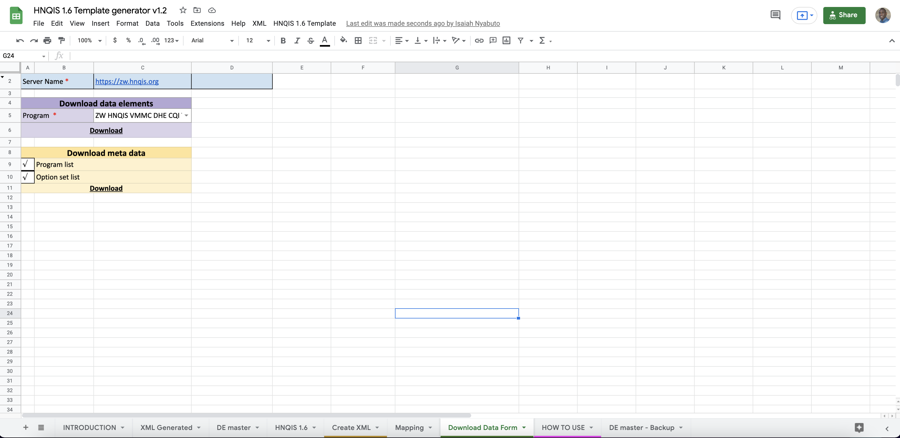

# hnqis-master-template

## Overview

Maintaining the latest copy of an HNQIS checklist involves tracking changes done to a single list over time. It's so easy to lose track of the changes when the list has had multiple changes over time.

`hnqis-master-template` allows you to:

- generate the latest copy of a checklist from an HNQIS configuration file or DHIS2 server.
- Download a list in the standard HNQIS template format (both excel and pdf formats are supported!). 

## Getting started

`hnqis-master-template` builds on the current HNQIS configuration file, i.e., the gsheet file. To get started, please get the latest copy of the gsheet file here <insertLink>:

## Generating the latest copy of an HNQIS checklist

### 1. Download the checklist data elements from the server. 

- Specify the server url (where to get the checklist from)
- Download the program & option set listings (required only once per a country)
- Select the program or checklist you would like to generate.
- Download the program data elements

### 2. Generate the HNQIS checklist

## Future work

- Provide support for generating checklists with Question Hide Type, Group Hide and Match type options.

